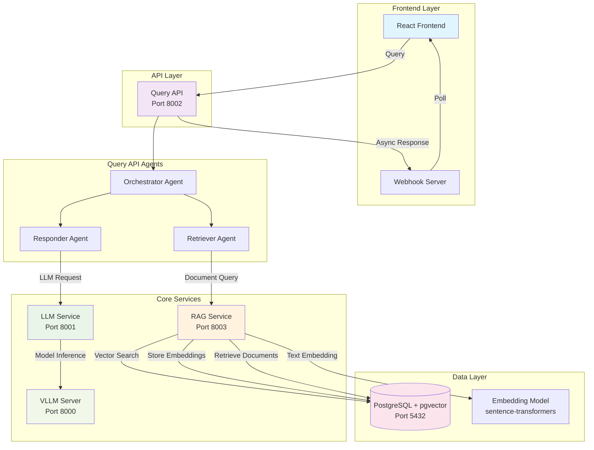
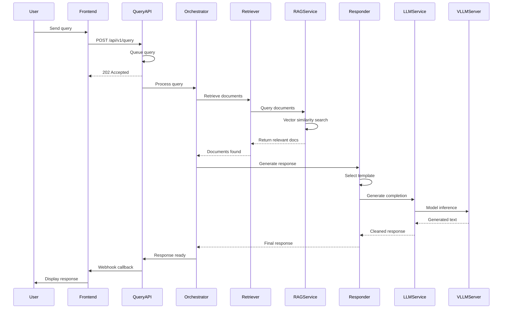
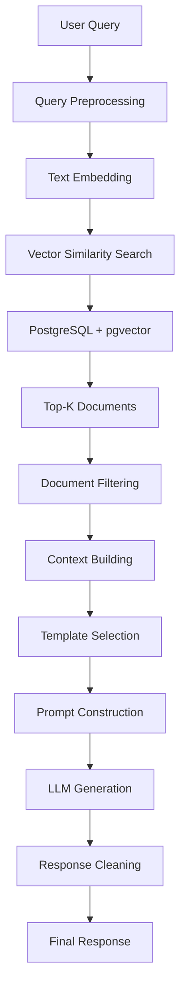

# RAG-Powered Product Query Chatbot

**🎥 Demo Video**: 

## Overview

This is a sophisticated RAG (Retrieval-Augmented Generation) chatbot system designed for electronics product queries. The system combines vector-based document retrieval with Large Language Model generation to provide accurate, contextual responses about electronic products while preventing hallucinations and maintaining strict response quality.

## 🎯 Objectives

- **Accurate Product Information**: Provide precise product details from a curated knowledge base
- **Hallucination Prevention**: Strict prompt engineering to prevent AI from inventing specifications or prices
- **Scalable Architecture**: Microservices-based design for independent scaling and maintenance
- **Real-time Responses**: Asynchronous processing with webhook-based response delivery
- **User Experience**: Clean, WhatsApp-like interface for natural conversation flow

## 🚀 Installation & Setup

### 1. Clone Repository
```bash
git clone https://github.com/LuisAlfonsoGarciaCamacho/product-query-bot
cd product-query-bot
```

### 2. Start Backend Services
```bash
# Start all backend services with Docker Compose
docker compose up -d

# Verify services are running
docker compose ps
```
**NOTE**: If you encounter any issues with the connection between backend services and webhook run:
```bash
sudo ufw allow 3001 
sudo ufw reload
```
### 3. Start Frontend Services
```bash
# Navigate to frontend directory
cd frontend

# Install dependencies
npm install

# Start webhook server (Terminal 1)
npm run webhook

# Start development server (Terminal 2)
npm run dev
```

### 5. Verification
```bash
# Check backend health
curl http://localhost:8002/api/v1/health

# Check webhook server
curl http://localhost:3001/health
```


## 🏗️ System Architecture



## 🔄 Information Flow

### 1. Query Processing Flow


### 2. Document Retrieval Flow


## 🧠 Prompt Engineering Strategy

### Template-Based Response Generation

The system uses a sophisticated template-based approach to ensure response quality:

#### 1. **Template Selection Logic**
- **Product Listing**: For queries about available products
- **Product Comparison**: For comparing multiple products
- **Specific Product**: For detailed product information
- **Category Explanation**: For explaining product categories
- **No Information**: When no relevant documents are found

#### 2. **Strict Prompt Rules**
```
CRITICAL RULES:
1. Use ONLY information from provided documents
2. NEVER invent prices, specifications, or features
3. NEVER mention pricing - redirect to sales team
4. If information is not available, explicitly state it
5. Keep responses under 150 words
6. Use markdown formatting for clarity
```

#### 3. **Response Cleaning Pipeline**
- **System Prompt Leakage Prevention**: Removes any template instructions from responses
- **Hallucination Detection**: Filters out invented specifications
- **Price Mention Handling**: Redirects price queries to sales team
- **Duplicate Content Removal**: Ensures concise, unique responses

#### 4. **Context Building Strategy**
- **Document Limitation**: Maximum 3 documents per query to prevent confusion
- **Content Truncation**: Documents limited to 200 characters to focus on key features
- **Category Organization**: Products automatically categorized (Smartphones, Laptops, etc.)

## 🛠️ Technical Requirements

### System Requirements
- **Docker & Docker Compose**: For backend services
- **Node.js 22+**: For frontend development
- **NVIDIA GPU**: For VLLM model inference (optional, can run on CPU)
- **8GB+ RAM**: Minimum for all services
- **10GB+ Storage**: For models and data
- **Firewall allowed on port 3001**: 'sudo ufw allow 3001 ; sudo ufw reload'

### Service Dependencies
- **PostgreSQL 16** with pgvector extension
- **Python 3.11+** for all backend services
- **VLLM** for LLM serving
- **Sentence Transformers** for embeddings
- **React** for frontend


## 📊 Service Ports

| Service | Port | Description |
|---------|------|-------------|
| Frontend | 3000 | React development server |
| Webhook Server | 3001 | Response callback handler |
| Query API | 8002 | Main API gateway |
| RAG Service | 8003 | Document retrieval service |
| LLM Service | 8001 | Language model interface |
| VLLM Server | 8000 | Model inference server |
| PostgreSQL | 5432 | Database with pgvector |

## 📁 Project Structure

```
product-query-bot/
├── frontend/                 # React frontend application
│   ├── src/
│   │   ├── components/      # UI components
│   │   ├── services/        # API and webhook services
│   │   └── App.jsx          # Main application
│   ├── webhook-server.js    # Webhook callback server
│   └── package.json
├── query-api/               # Main API orchestrator
│   ├── app/
│   │   ├── agents/          # Processing agents
│   │   ├── api/             # API endpoints
│   │   ├── prompts/         # Template system
│   │   └── services/        # External service clients
│   └── docker/
├── llm-service/             # LLM interface service
│   ├── app/
│   │   ├── api/             # LLM endpoints
│   │   └── services/        # VLLM integration
│   └── Dockerfile
├── rag-service/             # Document retrieval service
│   ├── app/
│   │   ├── services/        # Vector store & embeddings
│   │   └── utils/           # Data loading utilities
│   └── docker/
└── docker-compose.yml       # Service orchestration
```

## 🔧 Key Features

### ✅ What the System Does
- **Product Queries**: Answer questions about electronics products
- **Document Retrieval**: Find relevant product information using vector search
- **Template-Based Responses**: Structured, consistent response formatting
- **Multi-User Support**: Handle concurrent user sessions
- **Async Processing**: Non-blocking query processing with webhook callbacks
- **Response Quality Control**: Prevent hallucinations and maintain accuracy

### ❌ System Limitations
- **No Pricing Information**: All price queries redirected to sales team
- **Electronics Only**: Limited to pre-loaded electronics product database
- **Static Knowledge Base**: No real-time product updates
- **No Purchase Capability**: Information-only system
- **Limited Context**: No conversation history beyond current session

## 🎨 Frontend Features

- **WhatsApp-like Interface**: Familiar chat experience
- **Real-time Responses**: Live updates via webhook polling
- **Multi-User Simulation**: Switch between different user contexts
- **Markdown Support**: Rich text formatting in responses
- **Connection Status**: Visual indicators for system health
- **Responsive Design**: Works on desktop and mobile devices

## 🔍 API Endpoints

### Query API (Port 8002)
- `POST /api/v1/query` - Submit user query
- `GET /api/v1/health` - Service health check
- `GET /api/v1/system-info` - Detailed system information

### RAG Service (Port 8003)
- `POST /api/v1/query` - Query documents
- `POST /api/v1/documents` - Add documents
- `GET /api/v1/health` - Service health check

### LLM Service (Port 8001)
- `POST /api/v1/completion` - Text completion
- `POST /api/v1/chat/completion` - Chat completion
- `GET /api/v1/health` - Service health check

## 🧪 Testing

```bash
# Test backend services
curl -X POST "http://localhost:8002/api/v1/query" \
     -H "Content-Type: application/json" \
     -d '{"user_id":"test","query":"What products do you have?"}'

# Check webhook response
curl "http://localhost:3001/poll/test"
```


## 📦 Package Management with uv

This project uses **uv** as the Python package manager to ensure consistency, speed, and reliability across all backend services.

### Why uv?

- **Fast Installation**: Up to 10-100x faster than pip
- **Deterministic Builds**: Lock files ensure identical dependency versions across environments
- **Better Dependency Resolution**: Advanced solver prevents dependency conflicts
- **Cross-Platform Consistency**: Same behavior across different operating systems
- **Caching**: Efficient caching reduces repeated downloads

### uv Configuration

Each Python service includes:
- `pyproject.toml`: Project configuration and dependencies
- `uv.lock`: Lock file with exact dependency versions
- Docker integration with uv caching


## 🐛 Troubleshooting

### Common Issues

1. **Services Not Starting**
   ```bash
   docker compose logs [service-name]
   ```

2. **Frontend Not Connecting**
   - Verify webhook server is running on port 3001
   - Check CORS configuration in backend services

3. **No Responses**
   - Verify all services are healthy
   - Check webhook callback URL configuration

4. **GPU Issues**
   - VLLM can run on CPU if no GPU available
   - Adjust memory settings in docker-compose.yml
